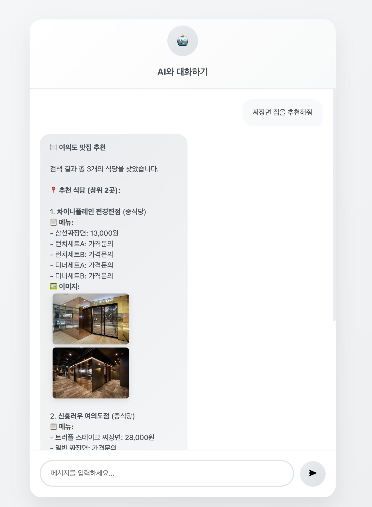
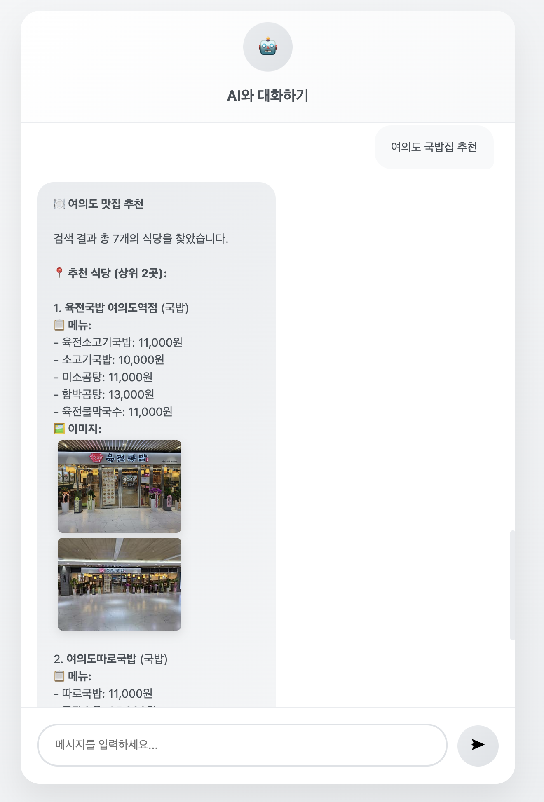

📋 프로젝트 개요 
GPT, Claude 등 일반적인 AI 모델은 특정 지역의 상세한 맛집 정보를 정확히 알지 못하는 문제가 있습니다. 이를 해결하기 위해 여의도 지역 맛집 전용 RAG(Retrieval-Augmented Generation) Agent를 개발했습니다. 

Backend 

AWS Lambda: 서버리스 컴퓨팅 
EC2 : ElasticServer 
Python 3.12: 백엔드 로직 
Claude 3 Haiku: AI 언어 모델 
Anthropic API: AI 서비스 
 
Database 
 
JSON 파일: 경량 데이터 저장 
228개 여의도 맛집 데이터 
 
사용 예시 

사용 예시 

 
🔮 향후 계획 
1. 지역 확장 
2. 검색정확도 확장 
3. Naver API 를 활용하여 검색 기능 추가 
4. 임베딩 기반 검색 